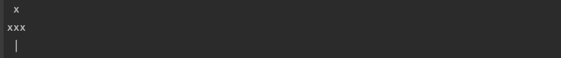
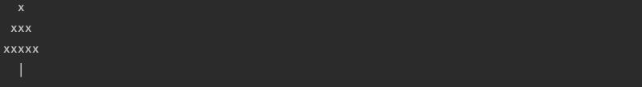
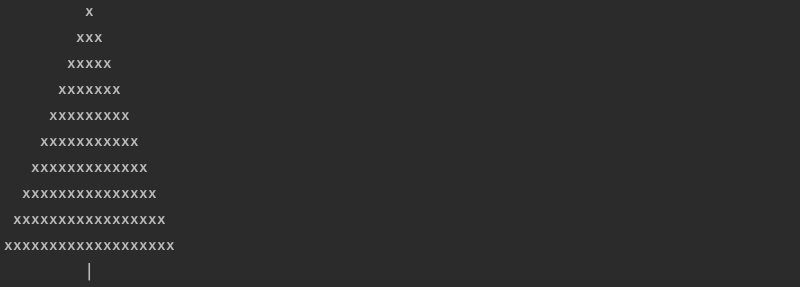

# build-a-christmas-tree
a fun kata to learn how to display and compare console application

There is a shortage of Christmas trees this year, however, you can help! In the absence of real trees, Santa is going to teach the children of the world the magic of the console.

Unfortunately, being approximately 1,751 years old, Santa can only write binary, and needs your help to write a program in a more modern language.

## Introductions

### Input

Given the children of the world have varying screen sizes, Santa has tasked you with printing a Christmas tree to the console for a given argument of the tree’s height to accommodate for all of the children.

### output

For example a tree with a height of 2 looks like this:

And a tree with a height of 3 looks like this:

And a tree of height 10:

